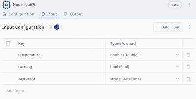
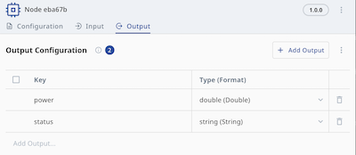

# NeoEdgeX App SDK Python v4 Developer Guide

> See the [Changelog](#changelog) at the end for the latest release notes.

## What This SDK Is

NeoEdgeX App SDK Python v4 is the Python SDK for building NeoEdgeX node applications such as drivers, protocol adapters, forwarders, and processors. It gives third-party developers a standard runtime model:

- receive upstream messages from NeoFlow through `ctx.messages()`
- read node configuration through `ctx.node_config()`
- publish downstream output through `ctx.publish(handle, ...)`
- report runtime errors through `ctx.report_error(...)`

The SDK also handles node lifecycle, message transport, heartbeats, error reporting, shutdown, and mock mode.

Python SDK 2.x speaks the NeoFlow CBOR message format: any node that implements the same format exchanges NeoFlow messages with a Python node byte-compatibly, and the golden fixtures in `tests/testdata/golden/` — recorded from a live peer node — are replayed through the Python encode/decode path on every test run.

## Public Surface

Third-party applications may depend on these packages:

- `neoedgex` — the app entry point, the handler interface, and the types a handler works with
- `neoedgex.contract` — the schema types: `DataType`, `PortFieldSchema`, `NodeData`
- `neoedgex.mock` — the configuration format for local mock runs
- `neoedgex.testutil` — a `NodeEnv` double and a message builder, for unit tests; a production entrypoint has no reason to import it

An app that only reads values and publishes values never has to import `neoedgex.contract` — `DataType`, `Node`, `Message`, `Logger`, and `ErrorCode` are re-exported from `neoedgex`. You need `contract` as soon as you name a schema type in Python code, for example to build a node configuration in a test or to walk `node_config().data.inputs`.

These are the entry points documented by this guide:

- `neoedgex.new(handler)`
- `App.run()`
- `App.enable_mock(...)`
- `App.disable_sdk_log()`
- `neoedgex.load_mock_config(...)`
- `neoedgex.NodeHandler`
- `neoedgex.NodeEnv`
- `neoedgex.Node`
- `neoedgex.Message`, with `to_dict()` and `to_dataclass(...)`
- `neoedgex.Logger`
- `neoedgex.ErrorCode`, with the `neoedgex.CodeInitializationError` / `CodeNetworkError` / `CodeProcessError` aliases
- `neoedgex.DataType`
- `neoedgex.convert_to_typed_value(...)` — the conversion engine `publish` uses, callable directly
- `neoedgex.PortFieldData` — the `{type, value}` string-form field value used by mock configs and device-facing code
- `neoedgex.convert_any_value(...)` — turns a native Python value into its `PortFieldData` string form and inferred type
- `neoedgex.convert_value_by_type(...)` — parses a `PortFieldData` string back into the native Python value of its type
- `neoedgex.contract.PortFieldSchema`, `neoedgex.contract.NodeData`
- `neoedgex.mock.load_config(...)`
- `neoedgex.testutil.MockNodeEnv`, with `new_message(...)`
- `neoedgex.testutil.new_message(...)`, `testutil.UNDECLARED`, `testutil.Single`, `testutil.PublishedMessage`

Every other path in the repo is off-limits, `neoedgex._internal` above all: it is not part of the SDK contract and may change in any release.

## Quick Start

A NeoEdgeX app implements `neoedgex.NodeHandler` and starts with `neoedgex.new(...).run()`.

> This handler is executed as-is by [`tests/test_guide_examples.py`](../tests/test_guide_examples.py).

```python
import neoedgex


class ExampleApp:
    def handle(self, ctx: neoedgex.NodeEnv) -> None:
        for _msg in ctx.messages():
            try:
                ctx.publish("output1", {"power": 42.0})
            except Exception as err:
                ctx.report_error(neoedgex.CodeProcessError, err)


if __name__ == "__main__":
    neoedgex.new(ExampleApp()).run()
```

The handle and the key are not free-form: `publish` builds the payload from the node's output schema, so this example only sends something on a node whose `output1` handle declares a `power` field. Keys the schema does not declare are dropped, which is the first thing to check when nothing reaches the downstream node. See Output Schema below.

To disable internal SDK logs, call `disable_sdk_log()` before `run()`:

```python
app = neoedgex.new(ExampleApp()).disable_sdk_log()
app.run()
```

It silences only what the SDK writes about itself. Lines your handler writes through `ctx.logger()` keep coming out.

## Configuring a Custom App

The SDK reads platform-mounted files from the fixed root path `/opt/neoedgex`:

- `/opt/neoedgex/config/messenger.json`: the MQTT account and password generated by the platform; the broker applies the topic permissions that belong to that account. Mounted read-only, so an app neither can nor needs to modify it.
- `/opt/neoedgex/config/config.json`: the node configuration delivered by the platform; the SDK exposes it to the handler through `ctx.node_config()`

A Custom App node is configured through the node definition returned by `ctx.node_config()`, in three areas:

1. `config.data.inputs`
2. `config.data.outputs`
3. `config.data.settings`

### Input Schema

Custom App input handles live under `config.data.inputs`:

```json
{
  "inputs": {
    "input1": [
      { "key": "temperature", "type": "double" }
    ],
    "input2": [
      { "key": "running", "type": "bool" }
    ],
    "input3": [
      { "key": "capturedAt", "type": "string" }
    ]
  }
}
```

A node can declare multiple input handles, each with its own field schema; the handler uses `msg.handle` to tell which input the message came from.

Input schema describes the fields your handler reads from `ctx.messages()`. Each field defines:

- `key`: the field name your handler reads from the decoded message
- `type`: the field data type, which fully determines the decoded Python value

When you adjust the input schema, you are changing which keys the SDK decodes by schema type when your handler calls `msg.to_dict()` on that handle — and which keys `msg.to_dataclass(...)` falls back to the schema for when a value the upstream node sent does not match the field's annotation. The keys your handler reads should stay aligned with this definition, and the resulting Python value type comes from the SDK's decode result.



### Output Schema

Custom App output handles live under `config.data.outputs`:

```json
{
  "outputs": {
    "output1": [
      { "key": "power", "type": "double" },
      { "key": "status", "type": "string" }
    ]
  }
}
```

A node can declare multiple output handles, each with its own field schema; the handler selects the destination by passing the handle name as the first argument to `ctx.publish(handle, data)`.

This schema controls how `ctx.publish(handle, {...})` is validated and converted:

- your published dict keys should match the keys defined under that `handle`
- the destination `type` determines which Python values are accepted and how they are converted
- omitted schema fields are published as CBOR null (undefined)
- explicit `None` values are also published as CBOR null

If you add, remove, or rename output fields here, update your `ctx.publish(...)` call to match.



### Settings

Custom App runtime settings live under `config.data.settings`, and map onto the generated `docker-compose.yml` like this:

- `containerName`: controls both the service key and `container_name`
- `image`: becomes the service `image`
- `envVars`: becomes the service `environment`
- `files`: becomes additional bind mounts under `volumes`
- `devices`: becomes the service `devices`
- `gpu.enabled=true`: adds a `gpus` section
- `portBindings`: becomes the service `ports`

Some fields belong to node settings but do not appear in the compose service:

- `credentials`: `neoedgex-agent` uses these credentials to log in to the Docker registry and pull the container image specified by `image`

The resulting `docker-compose.yml`:

```yaml
name: neoedgex
services:
  7719d4f0cc984dd6:
    container_name: 7719d4f0cc984dd6
    depends_on:
      neoedgex-messenger:
        condition: service_started
        required: true
    devices:
      - source: /dev/ttyUSB0
        target: /dev/ttyUSB0
        permissions: rw
    environment:
      a: b
    gpus:
      - capabilities:
          - gpu
        driver: nvidia
        count: -1
    image: 192.168.64.202:5001/busybox:stable
    networks:
      neoedgex-network: null
    restart: always
    ports:
      - target: 80
        published: "8080"
        protocol: tcp
    volumes:
      - type: bind
        source: ...
        target: /opt/neoedgex/config
        read_only: true
      - type: bind
        source: ...
        target: /var/myfile/ca-copy.crt
        read_only: true
```

### Passing App Config

An app reads its business configuration from environment variables or mounted files; the SDK carries those values into the container but does not parse your app's business config.

#### Pattern A: fixed-key env var config

Good for:

- small configuration payloads
- single strings or JSON blobs
- a small amount of configuration that fits naturally in environment variables

Define a fixed key in `settings.envVars`:

```json
"envVars": [
  {
    "key": "HTTPCLIENT_CONFIG_JSON",
    "value": "{\"endpoint\":\"https://api.example.com/ingest\",\"method\":\"POST\"}",
    "note": "app business config"
  }
]
```

The app then reads the fixed key:

```python
import os

raw = os.getenv("HTTPCLIENT_CONFIG_JSON", "")
if not raw:
    raise ValueError("HTTPCLIENT_CONFIG_JSON is required")
```

You can also split the fields into several fixed env vars:

```json
"envVars": [
  {
    "key": "HTTPCLIENT_ENDPOINT",
    "value": "https://api.example.com/ingest",
    "note": "HTTP endpoint"
  },
  {
    "key": "HTTPCLIENT_METHOD",
    "value": "POST",
    "note": "HTTP method"
  },
  {
    "key": "HTTPCLIENT_TIMEOUT_SECONDS",
    "value": "10",
    "note": "request timeout"
  }
]
```

```python
import os

endpoint = os.getenv("HTTPCLIENT_ENDPOINT", "")
method = os.getenv("HTTPCLIENT_METHOD", "")
timeout_raw = os.getenv("HTTPCLIENT_TIMEOUT_SECONDS", "")
```

#### Pattern B: fixed-path file config

Good for:

- larger JSON or YAML
- structured configuration
- certificates, keys, and secret files
- content that is easier to manage as a mounted file

Declare a fixed in-container path in `settings.files`:

```json
"files": [
  {
    "uuid": "app-config-file",
    "path": "/myconfig.json",
    "secret": "false"
  }
]
```

The app then reads that path directly:

```python
from pathlib import Path

payload = Path("/myconfig.json").read_text(encoding="utf-8")
```

#### Choosing env var vs file

- small values or small JSON payloads: prefer env vars
- larger or structured config: prefer files
- certificates, keys, and secret files: usually prefer files
- if your app supports both env and file, define a fixed precedence order inside the app, for example env first and file second

The SDK does not decide that precedence; it is part of your app contract and should be documented by the app itself.

## Message Model

NeoFlow nodes talk to each other over MQTT: one data message is one MQTT payload, encoded in CBOR — a compact binary format. You never build or parse that payload yourself — `msg.to_dict()` / `msg.to_dataclass(...)` decode what arrives, and `ctx.publish(...)` encodes what you send. This section describes both ends: what your handler receives from `ctx.messages()`, and what `publish` sends.

The message format in one paragraph: a data message is a CBOR map with three top-level keys — `source` (text), `timestamp` (RFC3339 text), and `data`. `data` is a flat map from each field key directly to its native CBOR value, with no per-field type wrapper. An undefined field is CBOR null (or the key is simply absent). `raw` fields are native CBOR byte strings, not base64 text. The move to CBOR covers data messages only: the error topic payload stays JSON and heartbeats stay empty — both guarded by `tests/test_runtime.py`. `tests/test_golden.py` replays a fixture recorded from a live peer node through the Python encode/decode path to keep the format from drifting.

### Runtime Terms

- `node`: one NeoEdgeX node configuration matched to your app
- `handle`: an input or output port name such as `input1` or `output1`
- `tag`: one named field of an input or output schema — the `key` / `type` pair, for example `{ "key": "temperature", "type": "double" }`
- `mock mode`: a local SDK mode that injects synthetic messages without a live platform


### NodeEnv and Message

Each handler receives a `neoedgex.NodeEnv`.

`NodeEnv` gives you:

- `node_config()` to read raw node configuration, including `data.settings`, `data.inputs`, and `data.outputs`
- `messages()` to receive incoming `neoedgex.Message`
- `context()` to get the lifecycle signal for this node — a `threading.Event` that is set when the node should stop; pass it to workers, HTTP, DB, gRPC, and other long-running work
- `logger()` to get the SDK-provided node-scoped logger
- `publish(handle: str, data: dict[str, object])` to emit on the specified output handle
- `report_error(code, err)` to report platform-visible node errors
- `stop()` to ask the SDK to stop this node, for a fatal error the handler cannot continue past

`neoedgex.Message` contains:

- `handle`: which input handle triggered this message
- `raw`: the `data` section of the received message exactly as it arrived, still CBOR-encoded; you do not read it directly — decode it with `msg.to_dict()` or `msg.to_dataclass(...)`
- `source`: source node ID
- `timestamp`: the time the upstream node published, in RFC3339 format. A node on this SDK version writes millisecond precision in UTC, so its stamp ends in `Z` (`2026-03-22T10:30:00.123Z`). The SDK passes the string through untouched and never validates it, so the form is whatever the sender wrote: a node on an older SDK writes second precision with no fraction, and a node whose clock is not UTC writes a local offset such as `+08:00`. Parse it with `datetime.fromisoformat`, which reads all of these, rather than matching it literally. It is an empty string when the upstream payload carries no time at all

### Reading Input Values

`msg.raw` holds the `data` section of the received message, still CBOR-encoded. Call `msg.to_dict()` to decode it into a `dict[str, Any]` of native Python values:

- every field declared in the input schema is decoded as the Python type of the `type` declared for that tag (see the tables below)
- a field is `None` when it is **undefined**: the upstream node did not produce it (CBOR null), the key is absent from the received message, or the received value could not be read or converted to the schema type
- when the type of a received value differs from the schema type, the SDK converts it using the same cross-type conversion rules used on the publish side (integer range checks, float-to-int truncation, string-to-number parsing, NaN/Inf rejected); if the rules do not allow the conversion or it fails, the field is delivered as `None`
- keys that appear in the received message but are **not** declared in the input schema are passed through as the plain Python value the decoder produces (see the tables below) and a debug log; a value the SDK delivers no Python type for arrives as `None` instead

`to_dict()` decodes once and caches internally: every call returns a **fresh, equal** dict, so mutating one returned dict is never visible to any other reader of the same message.

First dispatch on `msg.handle` to know which input the message came from, then check whether each expected key exists and whether the value is `None`.

Consider an input schema declaring a `double` field and a `string` field. Decoding the message gives:

> This example is executed as-is by [`tests/test_guide_examples.py`](../tests/test_guide_examples.py).

```python
from neoedgex import DataType
from neoedgex import testutil

# One message as the handler would receive it from ctx.messages();
# testutil builds the same thing in a test.
msg = testutil.new_message("input1", {
    "temperature": (25.5, DataType.DOUBLE),
    "deviceName": ("sensor-1", DataType.STRING),
})
# msg.handle == "input1", msg.source == "upstream-node"

data = msg.to_dict()
# data == {"temperature": 25.5, "deviceName": "sensor-1"}
```

Always take the message from `ctx.messages()`. A `neoedgex.Message` you construct yourself carries neither data nor an input schema, so `to_dict()` on it returns `{}`; to build one in a test, use `testutil.new_message` (see Unit Test Helper).

Apply the same defensive pattern to each field: check whether the key exists, then whether the value is `None`, then check the type. Using `temperature`:

> This handler is executed as-is by [`tests/test_guide_examples.py`](../tests/test_guide_examples.py).

```python
import neoedgex


class TemperatureApp:
    def handle(self, ctx: neoedgex.NodeEnv) -> None:
        for msg in ctx.messages():
            if msg.handle != "input1":
                # Handle not defined in the schema: ignore it.
                continue

            data = msg.to_dict()
            if "temperature" not in data:
                ctx.report_error(
                    neoedgex.CodeProcessError,
                    RuntimeError("internal error: input1 schema does not define tag temperature"),
                )
                continue
            value = data["temperature"]
            if value is None:
                ctx.report_error(
                    neoedgex.CodeProcessError,
                    RuntimeError("temperature was not successfully produced by the upstream node"),
                )
                continue
            if not isinstance(value, float):
                ctx.report_error(
                    neoedgex.CodeProcessError,
                    RuntimeError("internal error: tag temperature has an unexpected type, expected float"),
                )
                continue

            ctx.publish("output1", {"power": value * 2})
```

Other types follow the same flow with a different type in the `isinstance` check. When the tag is an integer type, remember that `bool` is an `int` subclass in Python — check `isinstance(value, bool)` first if your app must not accept `True` as `1`.

What the decoded dict means:

- `key not in data`: either your app is reading a tag that is not defined in the input schema — an internal error — or the whole `data` section could not be read, in which case `to_dict()` returns `{}` and every key is missing
- `key in data and data[key] is None`: the field is undefined — the previous node did not successfully produce that tag, the key was absent from the received message, or the value could not be read or converted to the schema type; whether to apply a default, skip, or report a process error is up to your app
- `key in data and data[key] is not None`: proceed with the Python type check; the value type follows the two tables below

#### Which Python Type a Value Arrives As

**Tag declared in the input schema.** When there is a value, it arrives as the Python type of the declared `type`; when there is none it arrives as `None`, as the two rules under the table describe:

| type | Python type seen by the handler |
| --- | --- |
| `bool` | `bool` |
| `int16` | `int` |
| `int32` | `int` |
| `int64` | `int` |
| `uint16` | `int` |
| `uint32` | `int` |
| `uint64` | `int` |
| `float` | `float` |
| `double` | `float` |
| `string` | `str` |
| `raw` | `bytes` |

> The delivery rules in this section are executed value by value by [`tests/test_type_table.py`](../tests/test_type_table.py) — when the implementation drifts from them, that test goes red.

Python has one unbounded `int` and one `float` (a 64-bit double), so the declared type does not pick a distinct Python type — it picks the **range check** on the way in and the **CBOR encoding** on the way out. Declaring `float` is not a label — it decides the narrowing, the range check, and the restore behavior.

Two rules apply on top of the table:

- if the upstream node sent a decimal number as single precision into a `double` tag, or as double precision into a `float` tag, the SDK normalizes it through the conversion rules and restores the shortest decimal: `25.34` sent as a single-precision number into a `double` tag arrives as `25.34`, not `25.34000015258789`
- if the value does not fit the declared type — for example `1e300` into a `float` tag — the conversion fails and the field arrives as `None`

**Tag not declared in the input schema.** The value is passed through as whatever the decoder produces, with no schema conversion. These are the only Python types delivered this way:

| what the upstream node sent | Python type seen by the handler |
| --- | --- |
| a decimal number, at any precision | `float` |
| a whole number from -9223372036854775808 to 18446744073709551615 | `int` |
| text | `str` |
| `true` / `false` | `bool` |
| binary data | `bytes` |
| anything else — a list, a nested structure, or a whole number outside the range above | `None` (undefined) |

A value the upstream sent as single precision arrives as the restored shortest decimal (`25.34`) on a key declared `float` or `double`; an undeclared key has no declared precision to restore against, so it arrives as the widened residue (`25.34000015258789`) — not data corruption, just how much information 32 bits carry.

The last row is a closed rule: the Python types listed above are everything the SDK delivers, and any other value arrives as `None`, with the key still present and a warning in the log. Lists and nested structures are never delivered — no tag type can declare one, so they only reach you from a sender that does not use this SDK, and they arrive as a single `None` for the whole value rather than partially. Whole numbers are the case you can hit in practice — they arrive as a number only inside the range listed above, even though Python itself could hold a bigger one.

Two CBOR tag cases round out the foreign-sender rules; both are pinned in `tests/test_golden.py`:

- **Time tags (tag 0 / tag 1).** No declarable type produces them. A declared field that receives one is delivered as undefined (`None`): the decoder yields a `datetime`, and `datetime` is not a type a data message carries.
- **Bignum tags (tag 2 / tag 3).** The SDK never sends one. The decoder absorbs the tag before any schema rule runs, so a bignum wrapping an integer that fits a normal CBOR integer arrives as that `int` on the undeclared path, and a declared numeric field applies its normal range rules to the wrapped integer.

**Anything the SDK cannot decode, convert, or represent arrives as `None`.** The key stays in the dict with a `None` value. That single rule covers every "no value" case: the upstream node produced no value, the key was missing from the received message, the value did not fit the declared type, the value could not be read at all, or the value has no Python type the SDK delivers.

There is one case where a key is not in the dict at all: a message whose whole `data` section is unreadable, which is what a corrupt payload looks like. `to_dict()` then returns `{}` — not even the schema keys — with a warning in the log.

### Decoding into a Dataclass

`msg.to_dataclass(SomeDataclass)` decodes the data map directly into a dataclass instance. It plays the role a validation library would otherwise play: for reading NeoFlow messages you do not need pydantic, the SDK's built-in decoder covers the schema-driven part.

The rules, all pinned in `tests/test_message.py`:

- **Target.** Only a dataclass *type* is accepted — an instance, a plain class, or `dict` raises `TypeError`. Every call builds and returns a **new** instance.
- **Key mapping.** The data-map key defaults to the field name; `field(metadata={"key": "deviceName"})` overrides it.
- **Undefined fields.** When the key is absent or the value is CBOR null, the field's declared default (or `default_factory`) stands. A field with no default is set to `None`.
- **The declaration wins.** A value that arrives as the CBOR kind matching the field's annotation is decoded directly as declared, and the input schema plays no part. `int` spans the int64 domain: any integer that arrives inside it, whatever the schema says, and one outside it raises. `float` follows the width the value was sent at: a single-precision value is restored to its shortest-decimal form (25.34, not 25.34000015258789), a double-precision value is taken as-is, and an arriving integer also decodes into a `float` annotation. `str`, `bytes` and `bool` take their own CBOR kinds directly.
- **Present but bad values.** When a value arrives as a kind that does not match the annotation, it is decoded by the input schema instead. Two cases then take this path: the upstream node sent a non-null value that could not be decoded into the schema type (`to_dict()` delivers `None` with a warning), and a schema-decoded value that does not fit the field's annotation. Either way, every concrete annotation — `float` and `float | None` alike — makes the whole call raise `ValueError` naming the field. Only the accept-as-is annotations (`Any`, `object`, missing) stay quiet: an undecodable value leaves such a field `None` with a log line. The declared default never stands in for a bad value — defaults cover only absent or null keys. Declare `X | None` for a field that may legitimately carry no value: `None` then means exactly "null or absent", which keeps the "real zero vs no value" distinction — a real `0.0` arrives as `0.0`, an undefined field as `None`, and a bad value raises.
- **Annotation handling on schema values.** On that schema route, the value's type must be the annotation's type — an `int` value does not widen into a `float` annotation. An `int` annotation never accepts a `bool` (`bool` is an `int` subclass in Python; the CBOR types are unrelated). `Any`, `object`, missing annotations, containers, and multi-type unions always accept the schema-decoded value as-is — for them there is no declaration to win.
- **`init=False` fields are skipped** — they cannot be passed to the constructor, so they keep whatever their own initialization produces.
- **All or nothing.** A failed call never leaves a half-written target: `to_dataclass` either returns a complete new instance or raises.

The two accessors split cleanly: `to_dict()` trusts the input schema, `to_dataclass` trusts your declaration. Python type hints carry no width — `int16` and `int64` are both `int`, `float32` and `float64` both `float` — so a declaration picks the kind, never a width: `int` behaves as a declared `int64`, and `float` follows the width the value was sent at, as described above.

The example below runs as it stands. `testutil.new_message(...)` builds the message your handler would receive from `ctx.messages()`; in your own app `msg` comes from that stream and a decode error goes to `ctx.report_error(...)` instead of propagating.

> This example is executed as-is by [`tests/test_guide_examples.py`](../tests/test_guide_examples.py).

```python
from dataclasses import dataclass, field
from typing import Any

from neoedgex import DataType
from neoedgex import testutil

# msg is one message from ctx.messages(); testutil builds the same thing in
# a test. Next to each value is the type the receiving node's input schema
# declares that key as, while testutil.UNDECLARED marks the keys the schema
# does not declare at all.
msg = testutil.new_message("input1", {
    "temperature": (None, DataType.DOUBLE),   # upstream produced no value
    "offset": (0.0, DataType.DOUBLE),         # upstream produced a real 0
    "count": (None, DataType.INT64),          # upstream produced no value
    "ratio": (testutil.Single(25.34), DataType.FLOAT),
    "level": (25.34, DataType.DOUBLE),
    "restored": (testutil.Single(25.34), testutil.UNDECLARED),
    "seq": (5, testutil.UNDECLARED),
    "total": (18446744073709551615, testutil.UNDECLARED),
    "deviceName": ("sensor-1", testutil.UNDECLARED),
    "running": (True, testutil.UNDECLARED),
    "payload": (b"\x01\x02", testutil.UNDECLARED),
})


@dataclass
class Reading:
    temperature: float | None = None  # no value -> the default None stands
    offset: float | None = None       # real 0 -> 0.0
    count: int = 0                    # no value -> default 0: a real 0 looks the same
    ratio: float = 0.0                # sent at single precision -> restored 25.34
    level: float = 0.0                # sent at double precision -> 25.34
    restored: float = 0.0             # not declared in the schema; the annotation
                                      # still wins -> restored 25.34 (to_dict(),
                                      # trusting the schema, would widen it)
    seq: int = 0                      # not declared -> 5
    total: Any = 0                    # above the int64 domain: an `int`
                                      # annotation would raise; Any takes the
                                      # natural int
    device_name: str = field(default="", metadata={"key": "deviceName"})
    running: bool = False             # not declared -> True
    payload: bytes = b""              # not declared -> b"\x01\x02"


reading = msg.to_dataclass(Reading)
assert reading == Reading(
    temperature=None,
    offset=0.0,
    count=0,
    ratio=25.34,
    level=25.34,
    restored=25.34,
    seq=5,
    total=18446744073709551615,
    device_name="sensor-1",
    running=True,
    payload=b"\x01\x02",
)
```

And the two sides of the incompatibility rule:

> This example is executed as-is by [`tests/test_guide_examples.py`](../tests/test_guide_examples.py).

```python
from dataclasses import dataclass
from typing import Any

import pytest

from neoedgex import DataType
from neoedgex import testutil

# The upstream node sent text where the dataclass expects a number.
msg = testutil.new_message("input1", {"count": ("not-a-number", DataType.STRING)})


@dataclass
class Strict:
    count: int = 0


@dataclass
class Pointer:
    count: int | None = None


@dataclass
class Loose:
    count: Any = None


with pytest.raises(ValueError):   # bare int: the whole call aborts
    msg.to_dataclass(Strict)

with pytest.raises(ValueError):   # int | None aborts the same way
    msg.to_dataclass(Pointer)

assert msg.to_dataclass(Loose).count == "not-a-number"  # Any: delivered as-is
```

### Publish Rules

`publish` behaves like this:

- it builds payloads against the schema defined under the `handle` argument; the handle must exist in `config.data.outputs`, otherwise `publish` raises `ValueError`
- if an output field defined in schema is missing from your `data`, the SDK publishes it as CBOR null (undefined)
- if you explicitly provide a field with `None`, the SDK also publishes it as CBOR null
- keys in your `data` dict that are not defined in that output schema are dropped (with a warning log) and will not appear in the published payload
- `ctx.publish(handle, {...})` accepts ordinary Python values, and the handler also reads ordinary Python values from `msg.to_dict()`
- a field declared `float` is narrowed to single precision before it is sent; a value whose magnitude is beyond the single-precision range (for example `1e300`) goes out as CBOR null for that field, with a node error reported
- `publish` raises in two cases only: the handle does not exist in `config.data.outputs`, or the MQTT publish fails. A field the SDK cannot convert to its schema type is **not** one of them: that field goes out as CBOR null, the SDK reports the failure to the platform on your behalf, and `publish` returns normally. Do not read a quiet return as "every field went out the way I meant it"

Those rules are pinned in `tests/test_runtime.py`.

Concrete example for missing output fields:

```python
# output1 schema:
# - power: type=double
# - status: type=string

ctx.publish("output1", {"power": 42.0})
```

The SDK publishes `power` from your value and publishes `status` as CBOR null, because it exists in schema but was omitted from `data`; the downstream handler reads it as `None` (undefined). Passing `status=None` produces the same result:

```python
try:
    ctx.publish("output1", {"power": 42.0, "status": None})
except Exception as err:
    ctx.report_error(neoedgex.CodeProcessError, err)
```

### Python Value Conversion

`ctx.publish` conversion is controlled by the destination type defined under that handle's schema. The converted value is sent as a native CBOR value of that type. The engine is `neoedgex.convert_to_typed_value(value, dest_type)`, which you can also call directly.

<table>
  <thead>
    <tr>
      <th>Destination type</th>
      <th>Python value category</th>
      <th>Conversion rule</th>
      <th>Example</th>
      <th>Rejects / notes</th>
    </tr>
  </thead>
  <tbody>
    <tr>
      <td rowspan="2"><code>bool</code></td>
      <td><code>bool</code></td>
      <td>Kept unchanged.</td>
      <td><code>True -&gt; True</code></td>
      <td rowspan="2">Plain <code>str</code> is not accepted.</td>
    </tr>
    <tr>
      <td><code>int</code>, <code>float</code></td>
      <td>Zero / non-zero semantics: <code>0</code> or <code>0.0</code> becomes <code>False</code>; any other value becomes <code>True</code>.</td>
      <td><code>0 -&gt; False</code>; <code>3.14 -&gt; True</code></td>
    </tr>
    <tr>
      <td rowspan="4"><code>int16</code>, <code>int32</code>, <code>int64</code></td>
      <td><code>int</code></td>
      <td>Range-checked against the declared width.</td>
      <td>destination <code>int64</code> + <code>42 -&gt; 42</code></td>
      <td rowspan="4"><code>NaN</code>, <code>Inf</code>, out-of-range values, <code>datetime</code>, and <code>bytes</code> fail.</td>
    </tr>
    <tr>
      <td><code>float</code></td>
      <td>Fractional parts are truncated first, then the value is range-checked.</td>
      <td>destination <code>int64</code> + <code>12.9 -&gt; 12</code></td>
    </tr>
    <tr>
      <td><code>bool</code></td>
      <td><code>True</code> becomes <code>1</code>, <code>False</code> becomes <code>0</code>.</td>
      <td>destination <code>int32</code> + <code>True -&gt; 1</code></td>
    </tr>
    <tr>
      <td>numeric <code>str</code></td>
      <td>Parsed strictly as an integer (no underscores, no surrounding whitespace), then range-checked.</td>
      <td>destination <code>int16</code> + <code>"42" -&gt; 42</code></td>
    </tr>
    <tr>
      <td rowspan="4"><code>uint16</code>, <code>uint32</code>, <code>uint64</code></td>
      <td><code>int</code></td>
      <td>Accepted only when non-negative and within the declared width.</td>
      <td>destination <code>uint32</code> + <code>42 -&gt; 42</code></td>
      <td rowspan="4">Negative values, <code>NaN</code>, <code>Inf</code>, and out-of-range values fail.</td>
    </tr>
    <tr>
      <td><code>float</code></td>
      <td>Fractional parts are truncated first, then the value is range-checked.</td>
      <td>destination <code>uint64</code> + <code>12.9 -&gt; 12</code></td>
    </tr>
    <tr>
      <td><code>bool</code></td>
      <td><code>True</code> becomes <code>1</code>, <code>False</code> becomes <code>0</code>.</td>
      <td>destination <code>uint32</code> + <code>True -&gt; 1</code></td>
    </tr>
    <tr>
      <td>numeric <code>str</code></td>
      <td>Parsed strictly as an integer, then range-checked.</td>
      <td>destination <code>uint32</code> + <code>"42" -&gt; 42</code></td>
    </tr>
    <tr>
      <td rowspan="4"><code>float</code>, <code>double</code></td>
      <td><code>int</code></td>
      <td>Converted to the destination float precision.</td>
      <td>destination <code>double</code> + <code>42 -&gt; 42.0</code></td>
      <td rowspan="4"><code>NaN</code>, <code>Inf</code>, <code>datetime</code>, and <code>bytes</code> are not accepted. Destination <code>float</code> rejects magnitudes beyond float32 range.</td>
    </tr>
    <tr>
      <td><code>float</code></td>
      <td>Converted to the destination precision: destination <code>float</code> narrows to single precision (shortest decimal), destination <code>double</code> keeps the value.</td>
      <td>destination <code>float</code> + <code>25.5 -&gt; 25.5</code></td>
    </tr>
    <tr>
      <td><code>bool</code></td>
      <td><code>True</code> becomes <code>1.0</code>, <code>False</code> becomes <code>0.0</code>.</td>
      <td>destination <code>double</code> + <code>True -&gt; 1.0</code></td>
    </tr>
    <tr>
      <td>numeric <code>str</code></td>
      <td>Parsed strictly as a decimal number.</td>
      <td>destination <code>double</code> + <code>"3.14" -&gt; 3.14</code></td>
    </tr>
    <tr>
      <td rowspan="4"><code>string</code></td>
      <td><code>str</code></td>
      <td>Kept unchanged.</td>
      <td><code>"neoedgex" -&gt; "neoedgex"</code></td>
      <td rowspan="4"><code>datetime</code> and <code>bytes</code> are not accepted.</td>
    </tr>
    <tr>
      <td><code>int</code></td>
      <td>Converted to decimal strings.</td>
      <td><code>42 -&gt; "42"</code></td>
    </tr>
    <tr>
      <td><code>float</code></td>
      <td>Converted to scientific-notation strings.</td>
      <td><code>25.5 -&gt; "2.55e+01"</code></td>
    </tr>
    <tr>
      <td><code>bool</code></td>
      <td>Converted to <code>"true"</code> or <code>"false"</code>.</td>
      <td><code>True -&gt; "true"</code></td>
    </tr>
    <tr>
      <td><code>raw</code></td>
      <td><code>bytes</code></td>
      <td>Sent as a native CBOR byte string (no base64). Only <code>raw</code> to <code>raw</code> is allowed; no other type converts to or from <code>raw</code>. <code>bytearray</code> is accepted and sent as <code>bytes</code>.</td>
      <td><code>b"hello"</code> is carried byte-for-byte.</td>
      <td>Other Python types are not accepted.</td>
    </tr>
  </tbody>
</table>

Three Python-specific notes on top of the table:

- **Python `int` is unbounded.** The declared type's range check is what stops a big value: `70000` into an `int16` field fails, and a value outside `[-2**63, 2**64-1]` fails for *every* numeric destination, because no data message can carry it — the SDK never emits a CBOR bignum. Pinned in `tests/test_golden.py` and `tests/test_contract.py`.
- **`datetime` is rejected for every destination type.** Format time values to a string in the app first (e.g. `value.isoformat()` or `value.strftime(...)`) and declare the field as `string`.
- Values that are not single scalar values — a dict, a list, a set, an object — are rejected for every destination type: the SDK reports an error and publishes the field as CBOR null.

Some rows of the table, runnable:

> This example is executed as-is by [`tests/test_guide_examples.py`](../tests/test_guide_examples.py).

```python
import pytest

from neoedgex import DataType, convert_to_typed_value

assert convert_to_typed_value(9527, DataType.BOOL) is True
assert convert_to_typed_value(12.9, DataType.INT64) == 12
assert convert_to_typed_value("42", DataType.INT16) == 42
assert convert_to_typed_value(25.5, DataType.STRING) == "2.55e+01"
with pytest.raises(ValueError):
    convert_to_typed_value(70000, DataType.INT16)
with pytest.raises(ValueError):
    convert_to_typed_value(float("nan"), DataType.DOUBLE)
```

The SDK decides whether a value can be converted from the Python value and the destination type declared by the schema. As a third-party app author, you usually only need to care about whether the Python value is accepted by the destination schema type.

Assume `output1` schema defines this field:

```text
- enabled: type=bool
```

If you publish this:

```python
ctx.publish("output1", {"enabled": 9527})
```

The SDK applies the `bool` zero / non-zero rule, so `enabled` is converted to `True`.

But if you publish this instead:

```python
ctx.publish("output1", {"enabled": "true"})
```

`publish` does not raise: the SDK publishes `enabled` as CBOR null (undefined) and calls `report_error` to notify the platform on your behalf.

### Publish Flow

The following is a complete end-to-end example of the publish pipeline.

Step 1: start from the `output1` schema. For this example, assume `output1` is:

```text
- temperature: type=double
- running: type=bool
- capturedAt: type=string
```

Step 2: the handler can publish ordinary Python values through `ctx.publish(...)`. A `string` field expects a Python `str`:

```python
import neoedgex


class ExampleApp:
    def handle(self, ctx: neoedgex.NodeEnv) -> None:
        for _msg in ctx.messages():
            try:
                ctx.publish(
                    "output1",
                    {
                        "temperature": 25.5,
                        "running": True,
                        "capturedAt": "2026-03-22T10:30:00Z",
                    },
                )
            except Exception as err:
                ctx.report_error(neoedgex.CodeProcessError, err)
```

Step 3: on the publisher side, the SDK converts those Python values to the schema types and encodes the whole message as CBOR. The message has three top-level fields: `source` (the publishing node), `timestamp` (the moment of publication, in RFC3339 with millisecond precision, taken from the container's clock and rendered in UTC — so it always ends in `Z`, whatever timezone the container runs in), and `data` (your published fields). Shown here in CBOR diagnostic notation, the human-readable rendering of CBOR — each field carries its native value, with no per-field type wrapper:

```text
{
  "source": "publisher-node",
  "timestamp": "2026-03-22T10:30:00.123Z",
  "data": {
    "temperature": 25.5,
    "running": true,
    "capturedAt": "2026-03-22T10:30:00Z"
  }
}
```

Step 4: when a downstream node receives that payload on its own `input1`, the handler decodes it with `msg.to_dict()` and each field arrives as the Python type of the downstream input schema:

```python
# msg.handle == "input1", msg.source == "publisher-node",
# msg.timestamp == "2026-03-22T10:30:00.123Z"

data = msg.to_dict()
# data == {
#     "temperature": 25.5,             # double -> float
#     "running": True,                 # bool -> bool
#     "capturedAt": "2026-03-22T10:30:00Z",  # string -> str
# }
```

## Mock Development Flow

Use mock mode for local development and integration testing without a live NeoEdgeX platform.

```python
import neoedgex
from neoedgex import mock


class ExampleApp:
    def handle(self, ctx: neoedgex.NodeEnv) -> None:
        for _msg in ctx.messages():
            try:
                ctx.publish("output1", {"value": "ok"})
            except Exception as err:
                ctx.report_error(neoedgex.CodeProcessError, err)


if __name__ == "__main__":
    app = neoedgex.new(ExampleApp())

    config = mock.load_config("./mock-config.json")
    app.enable_mock(config)

    app.run()
```

Minimal mock config shape:

> This config is loaded as-is by [`tests/test_guide_examples.py`](../tests/test_guide_examples.py).

```json
{
  "nodes": [
    {
      "id": "node-1",
      "type": "app",
      "data": {
        "name": "demo-node",
        "inputs": {
          "input1": [
            { "key": "temperature", "type": "double" }
          ]
        },
        "outputs": {
          "output1": [
            { "key": "value", "type": "string" }
          ]
        },
        "application": {
          "key": "demo-app",
          "version": "2.0.0"
        },
        "settings": {}
      }
    }
  ],
  "mock": {
    "messageInterval": "3s",
    "messages": [
      {
        "nodeID": "node-1",
        "handle": "input1",
        "data": {
          "temperature": {
            "type": "double",
            "value": "2.55e+01"
          }
        }
      }
    ]
  }
}
```

What that file has to get right:

- `mock.messages[].nodeID` must be exactly one of the `nodes[].id` values, and `handle` should be one the same node declares under `inputs`. A `handle` the node does not declare still delivers, but with no input schema behind it, so every value arrives untyped over the bypass path.
- messages are injected one per tick, cycling through the list from the top and starting about half a second after the app comes up. To exercise several inputs, list one message per input and let them rotate.
- `messageInterval` is a duration string: one or more number-plus-unit tokens, decimals allowed, with units `ns`, `us`, `ms`, `s`, `m`, `h` — such as `"3s"`, `"500ms"`, `"1.5s"` or `"1m30s"`. Missing, unparseable, or not positive falls back to 3s, with no error.
- injected values keep the stringified `type`/`value` form: floats in scientific notation (`"2.55e+01"`), `raw` as base64 text, bool as `"true"` / `"false"`. The SDK converts each entry to its native value at injection time and encodes a real CBOR message, so the handler sees the same decoded values as in production. An entry with an empty `type` injects an undefined field, which is how you exercise the `None` path. A legacy `format` key on an entry or a schema field is tolerated and ignored (pinned in `tests/test_mock.py`).
- every injected message arrives with `source` `"mock"` and a `timestamp` stamped from the same UTC clock the publish path uses, so mock runs see the production shape.
- there is no broker, so what your handler publishes is visible only in the log, as `[MOCK PUBLISH]` lines carrying the topic and the decoded payload. Heartbeats appear the same way, with an empty payload. `disable_sdk_log()` hides all of it.

`neoedgex.load_mock_config(...)` is a convenience wrapper around `neoedgex.mock.load_config(...)`. If your mock main already imports `neoedgex.mock`, prefer keeping `mock.load_config(...)` so the mock configuration source stays explicit.

Do not enable mock mode in production deployment.

## Unit Test Helper

`neoedgex.testutil` runs your `NodeHandler` without a platform and without a broker:

- `MockNodeEnv` stands in for the `NodeEnv` the SDK passes to `handle`. Set `config` to the node configuration under test, and optionally `mock_logger`, `done_event` (setting it "cancels" `ctx.context()`) and `publish_error` (the exception every `publish` call raises). After the handler has finished, read `published_data`, `reported_errors` and `stop_called`. `stop()` only records `stop_called` — it does not set `done_event`; a test whose handler must observe cancellation sets `done_event` itself.
- `env.new_message(handle, data)` builds an incoming message from the input schema in `config`, so its fields decode to exactly the types the SDK would deliver in production. It raises if `handle` is not declared in `config.data.inputs`. A schema key missing from `data` is delivered as `None`, like a value the upstream never produced.
- assign `env.message_iterable` (any iterable of messages) to feed the handler; when the iterable is exhausted the `for msg in ctx.messages()` loop ends, which is what lets the test assert afterwards.

> This test is executed as-is by [`tests/test_guide_examples.py`](../tests/test_guide_examples.py).

```python
from neoedgex import DataType
from neoedgex.contract import Node, NodeData, PortFieldSchema
from neoedgex.testutil import MockNodeEnv, PublishedMessage


def test_example_app() -> None:
    env = MockNodeEnv(
        config=Node(
            id="node-1",
            data=NodeData(
                name="demo-node",
                inputs={"input1": [PortFieldSchema(key="temperature", type=DataType.DOUBLE)]},
                outputs={"output1": [PortFieldSchema(key="power", type=DataType.DOUBLE)]},
            ),
        )
    )
    env.message_iterable = [env.new_message("input1", {"temperature": 25.5})]

    ExampleApp().handle(env)

    assert env.published_data == [PublishedMessage(handle="output1", data={"power": 42.0})]
```

Things to keep in mind:

- `published_data` records the dict your handler passed to `publish`, unchanged. Nothing is converted to the output schema types and nothing is dropped, so assert on the values your handler produced, not on what would reach the next node.
- messages built by `testutil` carry source `"upstream-node"` and timestamp `"2026-01-01T00:00:00.000Z"`; assign `msg.source` / `msg.timestamp` after building to override.

Without a node configuration at hand — when testing decode logic on its own — `testutil.new_message(handle, {...})` builds a message with the declared type written next to each value: `{"level": (testutil.Single(25.34), DataType.DOUBLE)}` reproduces a `double` tag the upstream node sent at single precision, and `testutil.UNDECLARED` marks a key the input schema does not declare. The value is encoded by its Python type (a bare float as double precision, `testutil.Single` as single precision), independent of the declared type, exactly as the two schemas are independent in production.

Use this package only in tests. Production app entrypoints do not need to import `neoedgex.testutil`.

## Runtime Behavior

The SDK is responsible for:

- SDK initialization and shutdown
- node instance lifecycle
- message transport integration
- periodic heartbeats
- publishing the errors your handler reports
- process signal handling
- handler supervision and restart

As a handler author, you are responsible for:

- reading messages from `ctx.messages()`
- implementing your business logic
- publishing output and reporting errors correctly
- passing `ctx.context()` — the stop event — into workers, HTTP, DB, gRPC, and other long-running work
- using `ctx.logger()` when you need node-scoped logs
- returning when `ctx.messages()` is closed

Runtime rules:

- every node in the configuration runs `handle(ctx)` in its own thread; the SDK does no filtering, and the same handler object serves all of them, so it must be safe for concurrent use
- if your handler raises, the SDK recovers and treats it as a node failure
- if your handler returns early while the node is still active, the SDK treats it as abnormal and restarts it
- if shutdown is intentional and the message stream closes, your handler should return normally
- if your handler detects a fatal initialization error, call `ctx.report_error(neoedgex.CodeInitializationError, err)`, then `ctx.stop()`, then return
- the inbound message buffer holds 4096 messages; if your handler processes messages slower than they arrive and the buffer fills up, incoming messages are dropped — the SDK internally calls `report_error` but the dropped messages cannot be recovered
- a second, much smaller queue sits between the broker and that buffer; when a burst overflows it, the message is dropped with only a warning in the log and no reported error, so the count of reported drops is a lower bound
- calling `ctx.stop()` also sets `ctx.context()`; any workers or long-running loops that watch that event for cancellation should wind down
- `ctx.stop()` ends this node only: sibling nodes of the same app keep running, `run()` does not return, and the process stays up until the platform stops the container

For example:

```python
import neoedgex


class ExampleApp:
    def handle(self, ctx: neoedgex.NodeEnv) -> None:
        try:
            parse_settings(ctx.node_config())
        except Exception as err:
            ctx.report_error(neoedgex.CodeInitializationError, err)
            ctx.stop()
            return
```

## Common Pitfalls

- Returning from `handle` too early. The normal steady-state model is to loop over `ctx.messages()`.
- Treating a missing key and a present-but-`None` value in the `msg.to_dict()` result as the same condition.
- Giving a `to_dataclass` field a bare annotation (`float` instead of `float | None`) when your app must distinguish an actual zero from an undefined value.
- Checking `isinstance(value, int)` without excluding `bool` first — `bool` is an `int` subclass in Python.
- Importing anything under `neoedgex._internal` instead of the public packages.
- Leaving mock mode enabled in production code.
- Assuming every input tag always contains a directly usable value; in practice, some fields may be `None` (undefined), and the app needs to decide how to handle them.

## Changelog

This SDK follows [Semantic Versioning](https://semver.org/spec/v2.0.0.html). Most recent releases first.

### v2.1.0 — 2026-08-13

- **Millisecond message timestamps.** The envelope `timestamp` is RFC3339 with a fixed three-digit fraction (`2026-03-22T10:30:00.123Z`) instead of whole seconds, so samples taken within the same second are no longer written as the same time. Sub-millisecond digits are truncated rather than rounded, and the rendering is byte-identical to the Go SDK's for the same instant. The field remains a CBOR text string and `datetime.fromisoformat` reads both forms, so a node still publishing second-precision stamps interoperates in both directions. Consumers that validate the stamp against a fixed-length pattern, or parse it with `strptime` without `%f`, must be updated.
- **Fixed** string-to-`float` conversion to round the text directly to float32, as Go's `strconv.ParseFloat(s, 32)` does, instead of narrowing through float64. The double rounding could select the adjacent float32 when the text sits on a rounding boundary (`"7.038531e-26"`), and at the float32 overflow boundary could reject a value the Go SDK accepts as MaxFloat32 — the same tag value converting on one SDK and failing on the other. Expected results are pinned bit-for-bit against Go output; `double` conversions were always single-rounded and are unchanged.
- **Publish timestamps are always UTC.** The envelope `timestamp` is taken in UTC and therefore always ends in `Z`, instead of carrying the container's local offset. Receiving is unchanged: an inbound timestamp is delivered to the handler verbatim and never validated, whatever zone or precision it carries. Mock mode and `testutil` follow the publish form — a mock-injected message carries a UTC millisecond stamp instead of an empty string, and `testutil`'s default message timestamp is now `"2026-01-01T00:00:00.000Z"` rather than `"2026-01-01T00:00:00Z"`. Consumers that assume a local offset, and tests that compare either literal exactly, must be updated. Detect a mock-injected message by its source `"mock"` rather than by an empty timestamp.

### v2.0.0 — 2026-08-10

**BREAKING message-format and API change.** Schemas are type-only and data messages are CBOR. Matches the wire contract of Go SDK v2.1.0. Apps built with SDK 1.x cannot exchange NeoFlow messages with 2.0.0 apps and will not run unmodified; there is no dual-format transition mode — rebuild against this version and migrate.

- **Message format.** A data message is a CBOR map with three top-level keys — `source`, `timestamp`, and `data`; `data` maps each field key directly to its native CBOR value with no per-field `type`/`format`/`value` wrapper. An undefined field is CBOR null. `raw` fields are sent as native CBOR byte strings — never base64. The move to CBOR covers data messages only: the error topic payload stays JSON and heartbeats stay empty.
- **Reading messages.** The decoded `Message.data` dict attribute is **removed** — code that reads `msg.data` now raises `AttributeError`. `msg.raw` holds the `data` section still CBOR-encoded; decode it with `msg.to_dict()` (schema-driven, decoded once — every call returns a fresh, equal dict) or `msg.to_dataclass(SomeDataclass)`.
- **What your handler receives.** Each declared input field is decoded by the `type` declared for that tag: integers arrive as `int`, `float`/`double` as `float`, `string` as `str`, `raw` as `bytes`, `bool` as `bool`. A received value of a different type is converted through the same cross-type conversion rules `publish` uses; unconvertible values are delivered as undefined (`None`). Keys not declared in the input schema pass through as the plain decoded Python value, limited to the types the SDK delivers — anything else (a list, a nested structure, an integer beyond `[-2**63, 2**64-1]`) arrives as `None`.
- **Added** `Message.to_dataclass(...)`: decodes the data map into a dataclass — a value that arrives as the kind matching the field's annotation is decoded as declared (the declaration wins), the rest through the input schema — with `field(metadata={"key": ...})` key mapping, defaults standing in for undefined (absent or null) fields, and a `ValueError` for a present value a concrete annotation cannot take — `X | None` covers the undefined case, `Any` takes anything. It replaces what pydantic would otherwise do for message reading.
- **Removed** the `DataFormat` concept entirely: schemas and mock payloads carry `type` only (a legacy `format` key in a config file is tolerated and ignored). The time formats `second` / `millisecond` / `datetime` are gone — a time value is carried in a `string` field and its string format is decided by the application; `base64` is replaced by the `raw` type, which is `bytes` in both directions. The type set is the 11 scalar types: `int16`, `int32`, `int64`, `uint16`, `uint32`, `uint64`, `float`, `double`, `bool`, `string`, `raw`.
- **Removed** the top-level `datetime` convenience conversion: `publish` now rejects `datetime` values for every destination type; format times to strings in the app.
- **Added** NaN / ±Inf rejection: publishing a NaN or infinite float fails the field conversion, and the field is published as undefined.
- **Integer discipline.** Python `int` is unbounded; `publish` range-checks against the declared type, a value outside `[-2**63, 2**64-1]` is rejected for every numeric destination, and the SDK never emits a CBOR bignum.
- **Added** `neoedgex.testutil.new_message(...)`, `testutil.UNDECLARED`, `testutil.Single`, and `MockNodeEnv.new_message(...)` for building messages in unit tests exactly as an upstream node sends them.
- **Migration.** Replace every `msg.data` read with `msg.to_dict()`. Drop `format` keys from mock configs and schemas (tolerated but ignored). Declare time fields as `string` and format them in the app. Expect `bytes` (not base64 `str`) from `raw` fields.

### v1.1.1 — 2026-06-05

- Reverted the JSON data format that was introduced in v1.1.0 (removed the JSON payload conversion).

### v1.1.0 — 2026-05-20

- Added multi-handle support for input and output schemas. `ctx.publish` now takes the destination handle explicitly (`publish(handle, data)`), and handlers dispatch on `msg.handle`.
- Added a JSON data format for arbitrary JSON payloads (reverted in v1.1.1).

### v1.0.0 — 2026-05-05

- Initial public release.
