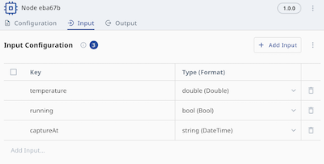
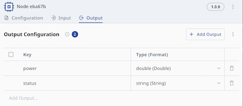
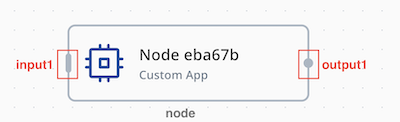

# NeoEdgeX App SDK Python v4 第三方開發指南

> 最新版本變更見[文末版本變更紀錄](#版本變更紀錄)。

## 這個 SDK 是什麼

NeoEdgeX App SDK Python v4 是用來開發 NeoEdgeX 節點應用程式的 Python SDK，適合用來實作 driver、protocol adapter、forwarder、processor 等節點。它提供第三方開發者一套固定的執行模型：

- 透過 `ctx.messages()` 接收來自 NeoFlow 的上游訊息
- 透過 `ctx.node_config()` 讀取節點設定
- 透過 `ctx.publish(handle, ...)` 發布下游輸出
- 透過 `ctx.report_error(...)` 回報執行錯誤

SDK 同時負責平台相關工作，例如節點生命週期、訊息傳輸整合、心跳、狀態回報、關閉流程，以及 mock 模式。

## 公開可依賴邊界

第三方應用程式只應依賴以下公開套件：

- `neoedgex`
- `neoedgex.mock`
- `neoedgex.testutil`（只建議用在單元測試）

本指南正式承認的公開入口如下：

- `neoedgex.new(handler)`
- `App.run()`
- `App.enable_mock(...)`
- `App.disable_sdk_log()`
- `neoedgex.load_mock_config(...)`
- `neoedgex.NodeHandler`
- `neoedgex.NodeEnv`
- `neoedgex.Node`
- `neoedgex.Message`
- `neoedgex.Logger`
- `neoedgex.ErrorCode`
- `neoedgex.mock.load_config(...)`
- `neoedgex.testutil.MockNodeEnv`

除了上面列出的公開 SDK surface 之外，即使 repo 裡還看得到其他路徑，也不要依賴那些內部或不穩定的實作結構；它們不屬於對外 SDK 契約。

## 套件依賴規則

正式 app 請只 import 這些套件：

- `neoedgex`
- `neoedgex.mock`

測試程式可額外 import：

- `neoedgex.testutil`

即使 repo 裡看得到其他路徑，也不要 import 內部或不穩定的實作套件。

## 最小可用範例

一個 NeoEdgeX app 需要實作 `neoedgex.NodeHandler`，並透過 `neoedgex.new(...).run()` 啟動。

```python
import neoedgex


class ExampleApp:
    def handle(self, ctx: neoedgex.NodeEnv) -> None:
        for _msg in ctx.messages():
            try:
                ctx.publish(
                    "output1",
                    {
                        "hello": "world",
                    },
                )
            except Exception as err:
                ctx.report_error(neoedgex.CodeProcessError, err)


if __name__ == "__main__":
    neoedgex.new(ExampleApp()).run()
```

如果你希望停用 SDK 內部 log，可在 `run()` 前呼叫：

```python
app = neoedgex.new(ExampleApp()).disable_sdk_log()
app.run()
```

## 如何設定 Custom App

SDK 會從固定的根路徑 `/opt/neoedgex` 讀取平台掛載進來的檔案：

- `messenger.json`：`/opt/neoedgex/config/messenger.json`，用來定義這個 app 透過 messenger 可以訂閱或發布哪些 NeoEdgeX topic；通常由平台自動產生，因此第三方 app 一般不需要手動修改
- `config.json`：`/opt/neoedgex/config/config.json`，由平台下發的節點設定檔；SDK 會讀取它，並把目前 node 的設定內容透過 `ctx.node_config()` 提供給 handler

Custom App node 的設定主要來自 `ctx.node_config()` 回傳的節點定義，主要包含三個區塊：

1. `config.data.inputs`
2. `config.data.outputs`
3. `config.data.settings`

### Input Schema

Custom App 的 input schema 定義在 `config.data.inputs` 底下，最常見的形狀如下：

```json
{
  "inputs": {
    "input1": [
      { "key": "temperature", "type": "double", "format": "double" },
      { "key": "running", "type": "bool", "format": "bool" },
      { "key": "payload", "type": "string", "format": "json" }
    ]
  }
}
```

你可以定義多個 input handle，例如 `input1`、`input2`、`input3`。所有 input 訊息會經由同一個 `ctx.messages()` stream 進入 handler，由 handler 依 `msg.handle` 分派到對應處理流程。

Input schema 的用途，是描述 handler 預期會從 `ctx.messages()` 讀到什麼欄位。每個欄位定義了：

- `key`：之後會出現在 `msg.data` 裡的欄位名稱
- `type`：欄位的基本資料型態
- `format`：該欄位的具體表示方式

當你調整 input schema 時，其實就是在改變 SDK 會如何把該 handle 的欄位解碼進 `neoedgex.Message.data`。handler 內讀取的 key 應和這裡的定義保持一致，而實際拿到的 Python 型別則取決於 SDK 的解碼結果。



### Output Schema

Custom App 的 output schema 定義在 `config.data.outputs` 底下，最常見的形狀如下：

```json
{
  "outputs": {
    "output1": [
      { "key": "power", "type": "double", "format": "double" },
      { "key": "status", "type": "string", "format": "string" }
    ]
  }
}
```

你可以定義多個 output handle，每次呼叫 `ctx.publish(handle, {...})` 時指定要送往哪一個。指定的 handle 對應到 `outputs` 裡的 schema，會直接影響這次 publish 的驗證與轉換行為：

- 你 publish 的 dict key 應該和該 handle 對應的 schema 裡定義的 key 一致
- destination `format` 會決定可接受哪些 Python 值，以及如何轉換
- 若 schema 中有欄位被省略，SDK 會補上空欄位，序列化後會是 `type=""`、`format=""`、`value=""`
- 明確傳入 `None` 也會被發布成空欄位

因此，只要你在這裡新增、刪除或改名 output 欄位，就應該同步調整 `ctx.publish(...)`。



### Settings

Custom App 的執行設定定義在 `config.data.settings`，這些欄位會如何影響最後產生的 `docker-compose.yml`：

- `containerName`：同時影響 service key 與 `container_name`
- `image`：會出現在 service 的 `image`
- `envVars`：會出現在 service 的 `environment`
- `files`：會變成 `volumes` 下的額外 bind mounts
- `devices`：會出現在 service 的 `devices`
- `gpu.enabled=true`：會讓 service 帶上 `gpus`
- `portBindings`：會出現在 service 的 `ports`

有些欄位雖然屬於 node settings，但不會直接呈現在下面這份 compose service 範例裡：

- `credentials`：`neoedgex-agent` 會用這組 credential 登入 docker registry，拉取 `image` 指定的 container image

最終的 `docker-compose.yml` 會是這樣：

```yaml
name: neoedgex
services:
  7719d4f0cc984dd6:
    container_name: 7719d4f0cc984dd6
    depends_on:
      neoedgex-messenger:
        condition: service_started
        required: true
    devices:
      - source: /dev/ttyUSB0
        target: /dev/ttyUSB0
        permissions: rw
    environment:
      a: b
    gpus:
      - capabilities:
          - gpu
        driver: nvidia
        count: -1
    image: 192.168.64.202:5001/busybox:stable
    networks:
      neoedgex-network: null
    restart: always
    ports:
      - target: 80
        published: "8080"
        protocol: tcp
    volumes:
      - type: bind
        source: ...
        target: /opt/neoedgex/config
        read_only: true
      - type: bind
        source: ...
        target: /var/myfile/ca-copy.crt
        read_only: true
```

### 傳遞 App Config

app 啟動之後，再從環境變數或掛載檔案中讀出真正的業務設定。SDK 會把這些內容帶進容器，但不會替你的 app 解析 business config schema。

#### 模式 A：用固定 key 的 env var 當 config

這種模式適合：

- 小型設定
- 單一字串或 JSON blob
- 少量、容易直接放進 environment 的設定

例如，你可以在 `settings.envVars` 定義固定 key：

```json
"envVars": [
  {
    "key": "HTTPCLIENT_CONFIG_JSON",
    "value": "{\"endpoint\":\"https://api.example.com/ingest\",\"method\":\"POST\"}",
    "note": "app business config"
  }
]
```

compose 產出後，這會變成 container 的 environment。app 啟動後，可以直接在程式裡用固定 key 讀取：

```python
import os

raw = os.getenv("HTTPCLIENT_CONFIG_JSON", "")
if not raw:
    raise ValueError("HTTPCLIENT_CONFIG_JSON is required")
```

這種做法的重點是：固定 env key、固定內容格式，都由 app 自己定義，SDK 不會替你決定。

如果你不想把完整 JSON 塞進單一 env var，也可以把原本 JSON 裡的欄位拆成多個固定 env var：

```json
"envVars": [
  {
    "key": "HTTPCLIENT_ENDPOINT",
    "value": "https://api.example.com/ingest",
    "note": "HTTP endpoint"
  },
  {
    "key": "HTTPCLIENT_METHOD",
    "value": "POST",
    "note": "HTTP method"
  },
  {
    "key": "HTTPCLIENT_TIMEOUT_SECONDS",
    "value": "10",
    "note": "request timeout"
  }
]
```

app 啟動後，可以逐一讀取這些固定 key：

```python
import os

endpoint = os.getenv("HTTPCLIENT_ENDPOINT", "")
method = os.getenv("HTTPCLIENT_METHOD", "")
timeout_raw = os.getenv("HTTPCLIENT_TIMEOUT_SECONDS", "")
```

這種做法適合欄位數量不多、每個欄位語意明確，而且你希望部署者可以直接覆寫單一設定值的情境。

#### 模式 B：用固定路徑的檔案當 config

這種模式適合：

- 較大的 JSON / YAML
- 結構化設定
- 憑證、key、secret file
- 需要以檔案形式人工替換或掛載的內容

例如，你可以在 `settings.files` 宣告一個固定讀取路徑：

```json
"files": [
  {
    "uuid": "app-config-file",
    "path": "/myconfig.json",
    "secret": "false"
  }
]
```

compose 產出後，這會變成 bind mount。app 啟動後，可以直接在程式裡讀這個固定路徑：

```python
from pathlib import Path

payload = Path("/myconfig.json").read_text(encoding="utf-8")
```

這種模式特別適合 app 想要自行管理完整設定檔格式，而不是把所有欄位拆成多個 env var。

#### 如何選擇 env var 或 file

可以用下面的原則快速決定：

- 小型、單值、少量 JSON：優先用 env var
- 較大或結構化 config：優先用 file
- 憑證、key、secret file：通常用 file
- 如果 app 同時支援 env 與 file，建議在 app 內明確定義固定優先順序，例如 env 先、file 後

SDK 不會替你的 app 決定這個優先順序；這是 app 自己的 contract，也應該在你的 app 文件中明確說明。

## 訊息模型

### 執行術語

幾個重要執行術語：

- `node`：一個被這個 app 匹配到的 NeoEdgeX 節點設定
- `handle`：input 或 output port 名稱，例如 `input1`、`output1`
- `mock mode`：SDK 的本地模擬模式，不需要真實平台就能注入假訊息


### NodeEnv 與 Message

每個 handler 會收到一個 `neoedgex.NodeEnv`。

`NodeEnv` 提供：

- `node_config()`：讀取原始節點設定，包括 `data.settings`、`data.inputs`、`data.outputs`
- `messages()`：接收進來的 `neoedgex.Message`
- `context()`：取得這個 node 的生命週期訊號，適合傳給 HTTP、DB、gRPC、worker loop 等長生命週期工作
- `logger()`：取得 SDK 提供的 node-scoped logger
- `publish(handle: str, data: dict[str, object])`：送出到指定的 output handle
- `report_error(code, err)`：回報平台可見的 node error
- `stop()`：通知 SDK 停止這個 node；通常用在 handler 判定無法繼續執行的 fatal error

`neoedgex.Message` 內容包含：

- `handle`：這次訊息是由哪個 input handle 觸發
- `data`：`dict[str, object]`，內容是已經從 NeoFlow 欄位解碼完成的 Python 原生值
- `source`：來源節點 ID
- `timestamp`：上游 publish 時間，格式為 RFC3339；若上游 payload 未提供則為空字串

### 讀取 Input 值

handler 讀到的 `msg.data` 已經是 Python 原生值。

你只需要判斷兩件事：key 有沒有存在，以及 value 是不是 `None`。

假設收到的 input payload 是：

```python
neoedgex.Message(
    handle="input1",
    source="upstream-node",
    timestamp="2026-03-31T09:10:11Z",
    data={
        "temperature": 25.5,
        "running": True,
        # format=json 的欄位以 raw JSON 文字遞給 handler，由 handler 自行 unmarshal
        "payload": '{"ratio":0.42,"userID":18000000000000000000}',
    },
)
```

handler 內建議這樣讀：

```python
import json
import neoedgex


class ExampleApp:
    def handle(self, ctx: neoedgex.NodeEnv) -> None:
        for msg in ctx.messages():
            if msg.handle != "input1":
                continue

            temperature: float
            if "temperature" not in msg.data:
                ctx.report_error(neoedgex.CodeProcessError, RuntimeError("internal error: input schema 沒有定義 tag temperature"))
                continue
            elif msg.data["temperature"] is None:
                ctx.report_error(neoedgex.CodeProcessError, RuntimeError("temperature 沒有由上游節點成功輸出"))
                continue
            elif not isinstance(msg.data["temperature"], float):
                ctx.report_error(neoedgex.CodeProcessError, RuntimeError("internal error: input schema 未定義 tag temperature 為 float"))
                continue
            else:
                temperature = msg.data["temperature"]

            running: bool
            if "running" not in msg.data:
                ctx.report_error(neoedgex.CodeProcessError, RuntimeError("internal error: input schema 沒有定義 tag running"))
                continue
            elif msg.data["running"] is None:
                ctx.report_error(neoedgex.CodeProcessError, RuntimeError("running 沒有由上游節點成功輸出"))
                continue
            elif not isinstance(msg.data["running"], bool):
                ctx.report_error(neoedgex.CodeProcessError, RuntimeError("internal error: input schema 未定義 tag running 為 bool"))
                continue
            else:
                running = msg.data["running"]

            # payload 欄位是 raw JSON 文字 (format=json)，SDK 不替你 unmarshal；
            # 是否要 decode、要當 object 還是 array，由 handler 自行決定。
            raw_payload: str
            if "payload" not in msg.data:
                ctx.report_error(neoedgex.CodeProcessError, RuntimeError("internal error: input schema 沒有定義 tag payload"))
                continue
            elif msg.data["payload"] is None:
                ctx.report_error(neoedgex.CodeProcessError, RuntimeError("payload 沒有由上游節點成功輸出"))
                continue
            elif not isinstance(msg.data["payload"], str):
                ctx.report_error(neoedgex.CodeProcessError, RuntimeError("internal error: input schema 未定義 tag payload 為 format=json"))
                continue
            else:
                raw_payload = msg.data["payload"]

            try:
                payload = json.loads(raw_payload)
            except ValueError as exc:
                ctx.report_error(neoedgex.CodeProcessError, RuntimeError(f"payload 不是合法的 JSON object: {exc}"))
                continue

            # 取出 payload.ratio 為 float。
            if not isinstance(payload, dict):
                ctx.report_error(neoedgex.CodeProcessError, RuntimeError("payload 不是 JSON object"))
                continue
            ratio = payload.get("ratio")
            if not isinstance(ratio, float):
                ctx.report_error(neoedgex.CodeProcessError, RuntimeError(f"payload.ratio 不是 float，而是 {type(ratio).__name__}"))
                continue

            _ = temperature, running, ratio
```

建議把 `msg.data` 的語意固定成這樣：

- `key not in msg.data`：代表程式正在讀一個沒有定義在 input schema 裡的 tag，應視為 internal error
- `key in msg.data and value is None`：代表前一個 node 沒有成功輸出該 tag；是否套 default、跳過、或回報 process error，取決於實作者
- `key in msg.data and value is not None`：再做正常的 Python 型別判斷與業務處理，型別必會與 input schema 中的 tag format 一致，見下表：

| format | handler 讀到的 Python 型別 |
| --- | --- |
| `bool` | `bool` |
| `int16` | `int` |
| `int32` | `int` |
| `int64` | `int` |
| `second` | `datetime.datetime` |
| `millisecond` | `datetime.datetime` |
| `uint16` | `int` |
| `uint32` | `int` |
| `uint64` | `int` |
| `float` | `float` |
| `double` | `float` |
| `string` | `str` |
| `datetime` | `datetime.datetime` |
| `base64` | `bytes` |
| `json` | `str`（raw JSON 文字） |

`json` format 的 wire value 是一段 JSON object 或 array 文字。SDK 不替你 `json.loads`，原樣以 `str` 交給 handler；要不要 unmarshal、是要當 object 還是 array，都由 handler 決定。

### 多 Input Handle 分派

當 node 定義了多個 input handle，所有 inbound 訊息仍會經由同一個 `ctx.messages()` stream 進入 handler，並由 handler 依 `msg.handle` 分辨來源。常見寫法是依 `msg.handle` 分派到不同處理流程，並把結果送往對應的 output handle：

```python
import neoedgex


class ExampleApp:
    def handle(self, ctx: neoedgex.NodeEnv) -> None:
        for msg in ctx.messages():
            if msg.handle == "input1":
                temperature = msg.data.get("temperature")
                # ... 處理 input1 ...
                ctx.publish("output1", {"api_path": "/temperature", "response_status": 200})
            elif msg.handle == "input2":
                running = msg.data.get("running")
                # ... 處理 input2 ...
                ctx.publish("output1", {"api_path": "/status", "response_status": 200})
            elif msg.handle == "input3":
                message = msg.data.get("message")
                # ... 處理 input3 ...
                ctx.publish("output1", {"api_path": "/event", "response_status": 200})
            else:
                # 未在 schema 中定義的 handle，忽略即可
                continue
```

傳給 `ctx.publish(...)` 的 handle 必須對應到 node config `outputs` 中的某個 key；否則該呼叫會 raise。

### Publish 規則

`publish` 目前真實語義如下：

- 第一個引數是 output handle 名稱；SDK 會依該 handle 在 node config 中對應的 schema 建構 payload
- 若該 handle 不存在於 `outputs`，呼叫會 raise
- 若 schema 中的欄位沒有出現在你傳入的 `data` 裡，SDK 會自動補成 empty field
- 若你明確提供某欄位但值是 `None`，SDK 也會把它補成 empty field
- `ctx.publish(handle, {...})` 接受一般 Python 值，而 handler 讀到的 `msg.data` 也同樣是一般 Python 值
- `data` 裡不在所選 handle schema 中的 key 一律忽略

缺少 output 欄位時的具體例子：

```python
# output1 schema:
# - power: type=double, format=double
# - status: type=string, format=string

ctx.publish(
    "output1",
    {
        "power": 42.0,
    },
)
```

這時 SDK 會用你的值建立 `power`，而 `status` 因為存在於 schema、卻沒有出現在 `data` 中，所以會自動補成 empty field。若你明確傳 `status=None`，結果也會相同。

也就是說，缺少 schema 欄位時，不是直接略過，而是會被發布成明確的 empty field。

```python
try:
    ctx.publish(
        "output1",
        {
            "power": 42.0,
            "status": None,
        },
    )
except Exception as err:
    ctx.report_error(neoedgex.CodeProcessError, err)
```

這表示你想明確把 `status` 發成 empty field。若你完全不傳 `status`，效果也一樣。

### Python 值轉換

當你用 `ctx.publish(handle, {...})` 發布 output 欄位時，轉換行為會由所選 handle 對應 schema 中的 destination format 決定。

<table>
  <thead>
    <tr>
      <th>Destination format</th>
      <th>Python 值類別</th>
      <th>轉換規則</th>
      <th>例子</th>
      <th>不接受 / 備註</th>
    </tr>
  </thead>
  <tbody>
    <tr>
      <td rowspan="2"><code>bool</code></td>
      <td><code>bool</code></td>
      <td><code>True -&gt; "true"</code>，<code>False -&gt; "false"</code></td>
      <td><code>True -&gt; "true"</code></td>
      <td rowspan="2">不接受普通 <code>str</code>。</td>
    </tr>
    <tr>
      <td>整數、浮點</td>
      <td>採用 zero / non-zero 規則：<code>0</code> 或 <code>0.0</code> 轉成 <code>"false"</code>；其他值都轉成 <code>"true"</code>。</td>
      <td><code>0 -&gt; "false"</code>；<code>3.14 -&gt; "true"</code></td>
    </tr>
    <tr>
      <td rowspan="4"><code>int16</code>、<code>int32</code>、<code>int64</code></td>
      <td><code>int</code></td>
      <td>轉到目標位寬，並做 range check。</td>
      <td><code>42 -&gt; "42"</code></td>
      <td rowspan="4"><code>NaN</code>、<code>Inf</code>、超出範圍的值、<code>datetime.datetime</code>、<code>bytes</code> 都會失敗。</td>
    </tr>
    <tr>
      <td><code>float</code></td>
      <td>先截斷小數部分，再做轉換與 range check。</td>
      <td>destination <code>int64</code> + <code>12.9 -&gt; "12"</code></td>
    </tr>
    <tr>
      <td><code>bool</code></td>
      <td><code>True</code> 轉成 <code>1</code> 或 <code>0</code>。</td>
      <td>destination <code>int32</code> + <code>True -&gt; "1"</code></td>
    </tr>
    <tr>
      <td>數字字串</td>
      <td>數字字串必須能被 parse 成目標格式。</td>
      <td>destination <code>int16</code> + <code>"42" -&gt; "42"</code></td>
    </tr>
    <tr>
      <td rowspan="4"><code>uint16</code>、<code>uint32</code>、<code>uint64</code></td>
      <td><code>int</code></td>
      <td>只有在結果非負且落在目標 uint 範圍內時，才可轉到目標位寬。</td>
      <td>destination <code>uint32</code> + <code>42 -&gt; "42"</code></td>
      <td rowspan="4">負值、<code>NaN</code>、<code>Inf</code>、超出範圍的值都會失敗。</td>
    </tr>
    <tr>
      <td><code>float</code></td>
      <td>先截斷小數部分，再做 uint 範圍檢查與轉換。</td>
      <td>destination <code>uint64</code> + <code>12.9 -&gt; "12"</code></td>
    </tr>
    <tr>
      <td><code>bool</code></td>
      <td><code>True</code> 轉成 <code>1</code> 或 <code>0</code>。</td>
      <td>destination <code>uint32</code> + <code>True -&gt; "1"</code></td>
    </tr>
    <tr>
      <td>數字字串</td>
      <td>數字字串必須能被 parse 成目標格式。</td>
      <td>destination <code>uint32</code> + <code>"42" -&gt; "42"</code></td>
    </tr>
    <tr>
      <td rowspan="4"><code>float</code>、<code>double</code></td>
      <td><code>int</code></td>
      <td>轉成目標浮點格式，並以 scientific notation 序列化。</td>
      <td>destination <code>double</code> + <code>42 -&gt; "4.2e+01"</code></td>
      <td rowspan="4">不接受 <code>datetime.datetime</code> 與 <code>bytes</code>。</td>
    </tr>
    <tr>
      <td><code>float</code></td>
      <td>轉成目標精度。</td>
      <td>destination <code>float</code> + <code>25.5 -&gt; "2.55e+01"</code></td>
    </tr>
    <tr>
      <td><code>bool</code></td>
      <td><code>True</code> 轉成 <code>1.0</code> 或 <code>0.0</code>。</td>
      <td>destination <code>double</code> + <code>True -&gt; "1e+00"</code></td>
    </tr>
    <tr>
      <td>數字字串</td>
      <td>數字字串必須能被 parse 成目標浮點格式。</td>
      <td>destination <code>double</code> + <code>"3.14" -&gt; "3.14e+00"</code></td>
    </tr>
    <tr>
      <td rowspan="2"><code>second</code>、<code>millisecond</code></td>
      <td>整數、浮點</td>
      <td>浮點值會先截斷成 <code>int</code>。接著數值會依 magnitude 推斷 epoch 單位：<code>&gt;= 1e17</code> 視為 ns、<code>&gt;= 1e14</code> 視為 us、<code>&gt;= 1e11</code> 視為 ms，其他視為 s。最後再序列化成 Unix seconds 或 Unix milliseconds。</td>
      <td>destination <code>second</code> + <code>1711094400.9</code> 會先截斷</td>
      <td rowspan="2">destination time formats 不接受普通 <code>str</code>。</td>
    </tr>
    <tr>
      <td><code>datetime.datetime</code></td>
      <td>依 destination format 直接轉成 Unix seconds 或 Unix milliseconds。</td>
      <td>destination <code>millisecond</code> + <code>datetime(2026, 3, 22, 10, 30, 0, tzinfo=UTC)</code> 會序列化成 Unix milliseconds</td>
    </tr>
    <tr>
      <td rowspan="2"><code>datetime</code></td>
      <td>整數、浮點</td>
      <td>浮點值會先截斷成 <code>int</code>。接著數值會依 magnitude 推斷 epoch 單位：<code>&gt;= 1e17</code> 視為 ns、<code>&gt;= 1e14</code> 視為 us、<code>&gt;= 1e11</code> 視為 ms，其他視為 s。最後會序列化成 RFC3339。</td>
      <td>destination <code>datetime</code> + <code>1711094400</code> 會轉成 <code>"2024-03-22T00:00:00Z"</code></td>
      <td rowspan="2">destination <code>datetime</code> 不接受普通 <code>str</code>。</td>
    </tr>
    <tr>
      <td><code>datetime.datetime</code></td>
      <td>直接轉成 RFC3339，例如 <code>2026-03-22T10:30:00Z</code>。</td>
      <td>destination <code>datetime</code> + <code>datetime(2026, 3, 22, 10, 30, 0, tzinfo=UTC) -&gt; "2026-03-22T10:30:00Z"</code></td>
    </tr>
    <tr>
      <td rowspan="4"><code>string</code></td>
      <td><code>str</code></td>
      <td>原樣保留。</td>
      <td><code>"neoedgex" -&gt; "neoedgex"</code></td>
      <td rowspan="4"><code>datetime.datetime</code> 不會自動轉成 plain <code>string</code>；若要輸出時間文字，schema 應該用 <code>datetime</code>。</td>
    </tr>
    <tr>
      <td><code>int</code></td>
      <td>轉成十進位字串。</td>
      <td><code>42 -&gt; "42"</code></td>
    </tr>
    <tr>
      <td><code>float</code></td>
      <td>轉成 scientific notation 字串。</td>
      <td><code>25.5 -&gt; "2.55e+01"</code></td>
    </tr>
    <tr>
      <td><code>bool</code></td>
      <td>轉成 <code>"true"</code> 或 <code>"false"</code>。</td>
      <td><code>True -&gt; "true"</code></td>
    </tr>
    <tr>
      <td><code>base64</code></td>
      <td><code>bytes</code></td>
      <td>做 base64 encode。</td>
      <td><code>b"hello" -&gt; "aGVsbG8="</code></td>
      <td>其他 Python 型別都不支援。</td>
    </tr>
    <tr>
      <td rowspan="2"><code>json</code></td>
      <td>任意可被 <code>json.dumps</code> 接受的值（<code>dict</code>、<code>list</code>、<code>tuple</code> 等）</td>
      <td>用 <code>json.dumps</code> 序列化後，結果必須是 JSON object (<code>{...}</code>) 或 array (<code>[...]</code>)。</td>
      <td><code>{"foo": "bar"} -&gt; '{"foo": "bar"}'</code>、<code>[1, 2, 3] -&gt; '[1, 2, 3]'</code></td>
      <td rowspan="2">序列化結果是 scalar（number、quoted string、bool、null）會被拒絕；無法 JSON 序列化的值（set、file handle 等）也會被拒絕。拒絕時該欄位會被設為 empty field 並呼叫 <code>report_error</code>，與其他 format 的型別轉換失敗一致。</td>
    </tr>
    <tr>
      <td><code>str</code> / <code>bytes</code>（已序列化過的 JSON 文字）</td>
      <td>原樣 passthrough（不再 serialise 一次）；必須通過 <code>json.loads</code> 驗證並是 object 或 array。<code>bytes</code> 會先用 UTF-8 decode 成 <code>str</code>。</td>
      <td><code>'{"foo":"bar"}' -&gt; '{"foo":"bar"}'</code></td>
    </tr>
  </tbody>
</table>

SDK 會依據 Python 值與 schema 指定的 destination format 決定是否可轉換；對第三方開發者來說，通常只需要關心「這個 Python 值能不能餵給這個 destination format」即可。

假設 `output1` schema 定義了這個欄位：

```text
- enabled: type=bool, format=bool
```

如果你這樣 publish：

```python
ctx.publish(
    "output1",
    {
        "enabled": 9527,
    },
)
```

SDK 會套用 `bool` 的 zero / non-zero 規則，因此 `enabled` 最終會被轉成 `true`。

但如果你這樣 publish：

```python
ctx.publish(
    "output1",
    {
        "enabled": "true",
    },
)
```

`ctx.publish(...)` 不因此 raise；SDK 把 `enabled` 設為 empty field，並呼叫 `report_error` 回報平台。`ctx.publish(...)` 只有在三種情況下才 raise：所選 output handle 未定義在 node config、JSON 序列化失敗、或 MQTT 發送失敗。型別轉換失敗不會透過例外傳遞。

### Publish 流程

以下是完整的 end-to-end 範例，說明 Python 值如何從 handler 流向下游節點。假設 `output1` schema 定義如下：

```text
- temperature: type=double, format=double
- running: type=bool, format=bool
- capturedAt: type=string, format=datetime
```

handler 發布 Python 值：

```python
from datetime import datetime
import neoedgex


class ExampleApp:
    def handle(self, ctx: neoedgex.NodeEnv) -> None:
        for msg in ctx.messages():
            if msg.handle != "input1":
                continue

            try:
                ctx.publish(
                    "output1",
                    {
                        "temperature": 25.5,
                        "running": True,
                        "capturedAt": datetime.now().astimezone(),
                    },
                )
            except Exception as err:
                ctx.report_error(neoedgex.CodeProcessError, err)
```

SDK 在 publisher 這一側轉成以下 output payload：

```json
{
  "source": "publisher-node",
  "data": {
    "temperature": {
      "type": "double",
      "format": "double",
      "value": "2.55e+01"
    },
    "running": {
      "type": "bool",
      "format": "bool",
      "value": "true"
    },
    "capturedAt": {
      "type": "string",
      "format": "datetime",
      "value": "2026-03-22T10:30:00Z"
    }
  }
}
```

下游 node 在 `input1` 收到後，SDK 解碼完成，handler 看到的 `neoedgex.Message` 為：

```python
from datetime import datetime

neoedgex.Message(
    handle="input1",
    source="publisher-node",
    timestamp="2026-03-22T10:30:00Z",
    data={
        "temperature": 25.5,
        "running": True,
        "capturedAt": datetime.fromisoformat("2026-03-22T10:30:00+00:00"),
    },
)
```

## Mock 開發流程

mock mode 適合本地開發與整合測試，不需要真實 NeoEdgeX 平台也能跑 handler。

```python
import neoedgex
from neoedgex import mock


class ExampleApp:
    def handle(self, ctx: neoedgex.NodeEnv) -> None:
        for msg in ctx.messages():
            try:
                ctx.publish("output1", {"value": "ok"})
            except Exception as err:
                ctx.report_error(neoedgex.CodeProcessError, err)


if __name__ == "__main__":
    app = neoedgex.new(ExampleApp())

    config = mock.load_config("./mock-config.json")
    app.enable_mock(config)

    app.run()
```

最小 mock config 形狀如下：

```json
{
  "nodes": [
    {
      "id": "node-1",
      "type": "app",
      "data": {
        "name": "demo-node",
        "inputs": {
          "input1": [
            { "key": "temperature", "type": "double", "format": "double" }
          ]
        },
        "outputs": {
          "output1": [
            { "key": "value", "type": "string", "format": "string" }
          ]
        },
        "application": {
          "key": "demo-app",
          "version": "1.0.0"
        },
        "settings": {}
      }
    }
  ],
  "mock": {
    "messageInterval": "3s",
    "messages": [
      {
        "nodeID": "node-1",
        "handle": "input1",
        "data": {
          "temperature": {
            "type": "double",
            "format": "double",
            "value": "2.55e+01"
          }
        }
      }
    ]
  }
}
```

`neoedgex.load_mock_config(...)` 是 `neoedgex.mock.load_config(...)` 的便利入口；如果你的 mock main 已經 import `neoedgex.mock`，建議維持使用 `neoedgex.mock.load_config(...)`，讓 mock 設定來源更明確。

正式部署時不要開啟 mock mode。

## 單元測試輔助

若你要單元測試自己的 `NodeHandler`，可以使用 `neoedgex.testutil.MockNodeEnv` 建立測試用的 `NodeEnv`。它可以設定 `config`、`message_iterable`、`done_event`、`mock_logger` 與 `publish_error`，並記錄 handler 呼叫過的 `published_data`、`reported_errors` 與 `stop_called`。每筆 publish 會以 `PublishedMessage(handle, data)` 的形式記錄下來，方便測試斷言用了哪個 output handle。

```python
from neoedgex.testutil import MockNodeEnv, PublishedMessage

ctx = MockNodeEnv(
    config=node_config,
    message_iterable=messages,
)

handler.handle(ctx)

assert ctx.published_data == [PublishedMessage(handle="output1", data={"value": "ok"})]
```

這個套件只建議用在測試；正式 app entrypoint 不需要 import `neoedgex.testutil`。

## 執行時行為

SDK 會負責：

- SDK 初始化與關閉
- node instance 生命週期
- 訊息傳輸整合
- 定期 heartbeats 與狀態發佈
- process signal 處理
- handler 監控與重啟

handler 作者自己要負責：

- 從 `ctx.messages()` 讀訊息
- 實作業務邏輯
- 正確發布 output 與回報錯誤
- 用 `ctx.context()` 作為 handler 啟動的 worker、connect、watcher、HTTP、DB、gRPC 等長生命週期工作的 root context
- 需要記錄 node-scoped log 時使用 `ctx.logger()`
- 在 `ctx.messages()` 關閉後正常 return

重要執行規則：

- 每個被匹配到的 node 都會在自己的執行路徑裡執行 `handle(ctx)`
- 若 handler raise，SDK 會 recover 並把它視為 node failure
- 若 handler 在 node 還活著時提早 return，SDK 會視為異常並重啟
- 若是正常關閉，訊息 stream 關閉後 handler 應直接 return
- 若 handler 在初始化階段發現無法繼續執行的 fatal error，應先 `ctx.report_error(neoedgex.CodeInitializationError, err)`，再 `ctx.stop()`，最後 return
- 呼叫 `ctx.stop()` 同時取消 `ctx.context()`
- 訊息 channel buffer 大小為 4096；buffer 滿時訊息會被 drop，SDK 同時呼叫 `report_error`，但被 drop 的訊息無法復原

例如：

```python
import neoedgex


class ExampleApp:
    def handle(self, ctx: neoedgex.NodeEnv) -> None:
        try:
            parse_settings(ctx.node_config())
        except Exception as err:
            ctx.report_error(neoedgex.CodeInitializationError, err)
            ctx.stop()
            return
```

## 常見錯誤

- `handle` 太早 return。正常 steady-state 寫法通常是持續讀 `ctx.messages()`。
- 把 `msg.data` 裡的 missing key 和 present-but-`None` 當成同一種情況。
- 因為 repo 看得到就直接依賴未公開的內部路徑。
- 正式版程式碼忘記拿掉 mock mode。
- 以為 `msg.data` 裡的每個 input tag 都一定會有可直接使用的值；實際上某些欄位可能是 `None`，需要由 app 自己決定怎麼處理。

## 版本變更紀錄

本 SDK 遵循 [Semantic Versioning](https://semver.org/spec/v2.0.0.html)。

### v1.1.0 — unreleased

#### 新增

- **多 handle 支援**：節點的 input 與 output schema 都可同時宣告多個 handle，handler 依 `msg.handle` 將訊息分派到對應流程。
- **`json` 資料格式**（schema 寫成 `type: "string", format: "json"`），用來承載任意 JSON 物件或陣列：
  - `ctx.publish` 可傳入任意能序列化為 JSON 物件或陣列的值。`str` 與 `bytes` 視為已經序列化好的 JSON 文字，原樣帶過（會以 `json.loads` 驗證合法性，`bytes` 先以 UTF-8 解碼）；其他型別走 `json.dumps`。最終結果必須是物件 (`{...}`) 或陣列 (`[...]`)，純量（數字、字串、布林、null）一律拒絕。
  - Handler 拿到的是原始 JSON 文字（Python `str`），由 handler 自行以 `json.loads` 反序列化。
  - `json` 與其他格式之間無法互相轉換。

#### 變更（不相容）

- `ctx.publish` 函式簽名變更：`publish(data: dict[str, Any]) -> None` → `publish(handle: str, data: dict[str, Any]) -> None`。呼叫端必須明確指定目的 output handle。
- `neoedgex.testutil.MockNodeEnv.published_data` 型別從 `list[dict[str, Any]]` 改為 `list[PublishedMessage]`，每筆紀錄會同時保留 publish 的 `handle` 與 `data`。

#### 文件

- 移除「只支援 `input1` / `output1`」的敘述，改以多 handle 為標準範例。
- 新增 `format=json` 的完整讀取範例，使用標準的 `json.loads` 解碼路徑。
- `format` 對 Python 型別的對照表，以及 `publish` 轉換表，皆新增 `json` 一列。

### v1.0.0 — 2026-05-05

首次公開發行。
